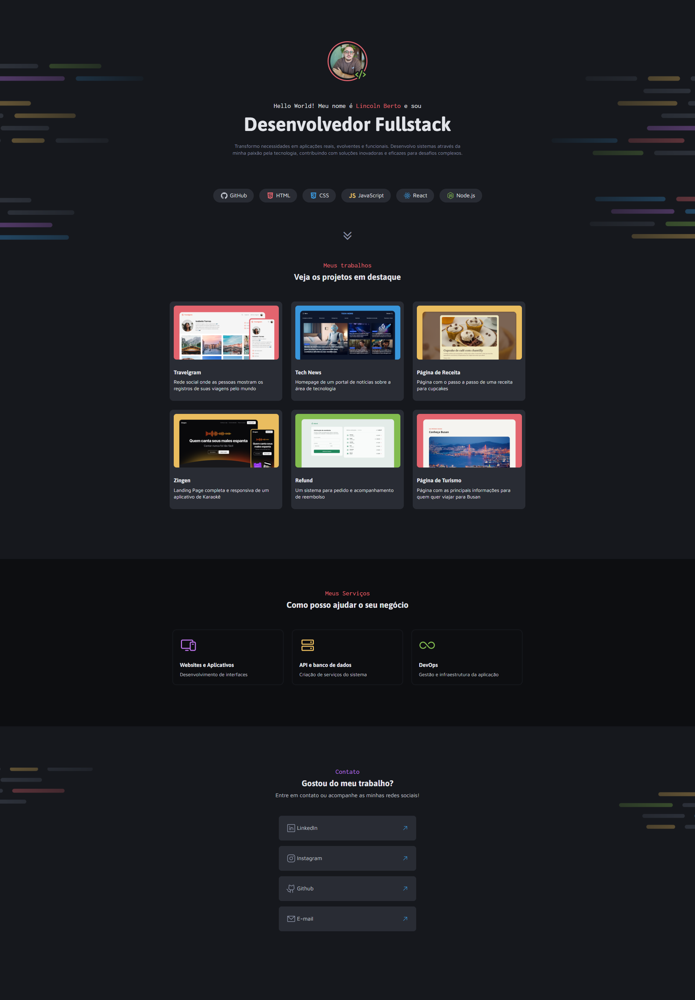

# 💼 Portfolio Lincoln Berto

Projeto de um portfólio pessoal moderno apresentando minha trajetória como **Desenvolvedor Fullstack**. O site apresenta meus principais projetos, serviços oferecidos e formas de contato, com design clean e profissional. Desenvolvido com foco em demonstrar habilidades técnicas e criatividade através de uma interface elegante e funcional.

---

# 🔗 Acesse o Projeto Online

Você pode acessar o projeto diretamente pelo link abaixo:
👉 [Clique aqui para ver o portfolio online](https://portfolio-dev-three-teal.vercel.app/)

---

## 🛠️ Como o Projeto Foi Feito

Este projeto foi construído com foco em criar uma apresentação profissional e impactante do meu trabalho como desenvolvedor. A estrutura da página está organizada em seções bem definidas:

- **Header**: Apresentação pessoal com foto, nome, título e tecnologias dominadas
- **Seção Projetos**: Grid showcase com 6 projetos principais em destaque
- **Seção Serviços**: Apresentação dos serviços oferecidos (Frontend, Backend, DevOps)
- **Seção Contato**: Links para redes sociais e formas de contato profissional

O design utiliza CSS Grid e Flexbox como principais tecnologias de layout, com um sistema de cores moderno e tipografia cuidadosamente escolhida usando as fontes **Asap**, **Inconsolata** e **Maven Pro** do Google Fonts. As imagens são otimizadas e o layout é focado na experiência do usuário.

---

## 🧠 Conceitos Trabalhados

- **HTML5** semântico
- **CSS3** avançado
  - CSS Grid Layout
  - Flexbox
  - CSS Custom Properties (variáveis)
  - Tipografia customizada
  - Hover effects e transições
- **Design System** com paleta de cores consistente
- **UX/UI** para portfolios profissionais
- **Organização modular** de CSS por componentes

---

## 📱 Funcionalidades

- ✅ Apresentação profissional com foto e descrição
- ✅ Showcase de projetos com thumbnails
- ✅ Seção de serviços organizados
- ✅ Links para redes sociais funcionais
- ✅ Design moderno com efeitos hover
- ✅ Estrutura semântica otimizada

---

## 🎨 Projetos em Destaque

- 📸 **Travelgram** - Rede social de viagens
- 📰 **Tech News** - Portal de notícias tech
- 🧁 **Página de Receita** - Tutorial de cupcakes
- 🎤 **Zingen** - Landing page de karaokê
- 💰 **Refund** - Sistema de reembolsos
- ✈️ **Página de Turismo** - Guia de Busan

---

## 🔍 Preview do Projeto



---

## 🧱 Tecnologias Utilizadas

- **HTML5**
- **CSS3**
- **JavaScript**
- **Google Fonts** (Asap, Inconsolata, Maven Pro)
- **Phosphor Icons**
- **CSS Grid & Flexbox**

---

## 📁 Estrutura do Projeto

```
portfolio-lincoln-berto/
├── index.html
├── style/
│   ├── index.css
│   ├── global.css
│   ├── header.css
│   ├── projetos.css
│   ├── servicos.css
│   └── contato.css
├── assets/
│   ├── icons/
│   │   ├── Code.svg
│   │   ├── GitHub.svg
│   │   ├── HTML.svg
│   │   └── outros ícones...
│   └── images/
│       ├── minha-foto.png
│       ├── Background_Intro.png
│       ├── Background_Contacts.png
│       └── Thumbnail_Project-01.png - 06.png
└── README.md
```

---

## 📄 Licença

Este projeto está licenciado sob a [Licença MIT](https://opensource.org/licenses/MIT).  
Você pode usar, modificar e distribuir livremente. Criado para fins de apresentação profissional e demonstração de habilidades.

## 👨‍💻 Autor

Desenvolvido com 💜 por @eilincoln - Portfolio focado em demonstrar experiência em desenvolvimento fullstack e design moderno.
